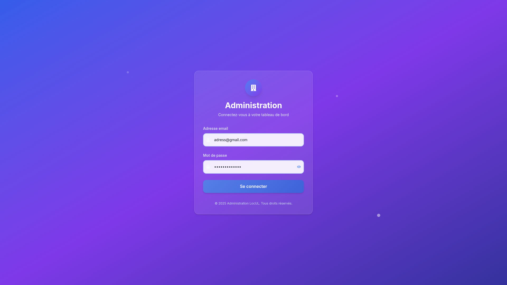
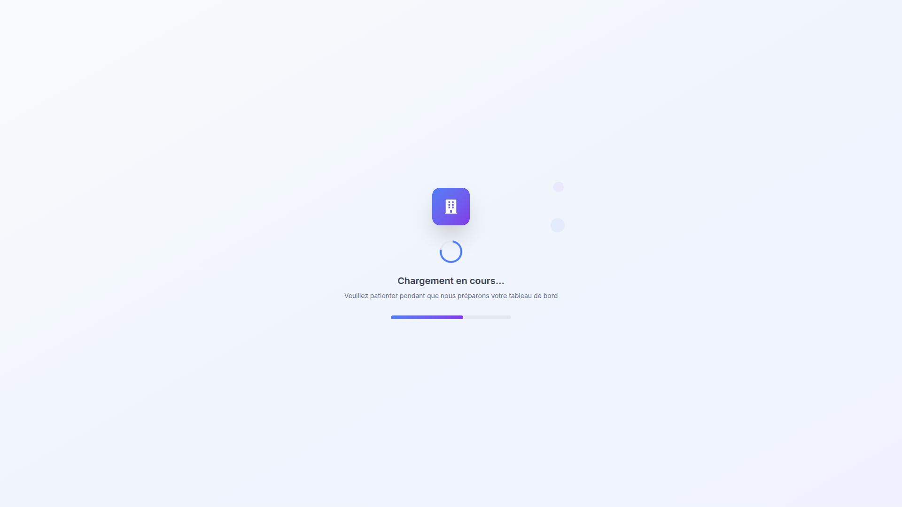
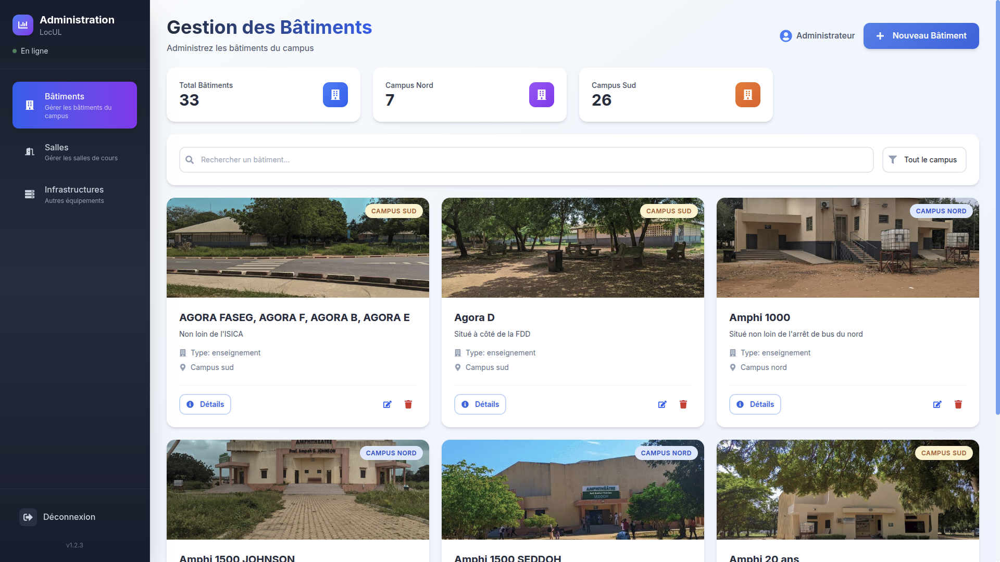
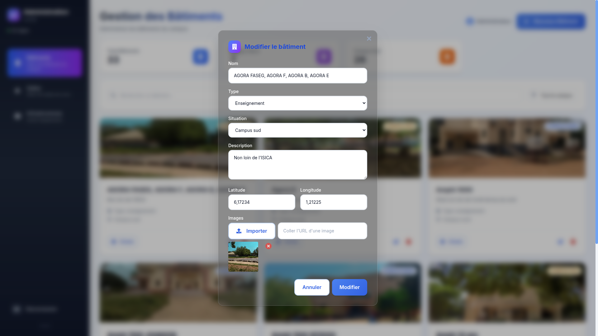

# 🛠️  Admin Site - Application Web d’Administration de ULMap

Application web d’administration pour la gestion des données de géolocalisation des bâtiments, salles et infrastructures de l’Université de Lomé


## 📖 Description

L’application web d’administration Admin Site est une application web conçue pour permettre la gestion centralisée des données de géolocalisation des bâtiments, salles et infrastructures utilisées par l’application mobile ULMap.

Elle permet aux administrateurs autorisés de :

- gérer les bâtiments
- gérer les infrastructures
- gérer les salles
- maintenir la cohérence des informations affichées sur la carte mobile

Cette application constitue l’interface d’administration (backend fonctionnel côté gestion) de ULMap
et alimente l’application mobile via des services backend (Firebase et Appwrite).

⚠️ Cette application n’est pas destinée au grand public.


## 🎯 Objectifs

- Centraliser la gestion des données géographiques du campus
- Garantir la fiabilité des informations affichées sur l’application mobile
- Offrir une interface simple et sécurisée pour l’administration
- Séparer clairement la partie consultation (mobile) de la partie gestion (web)


## ✨ Fonctionnalités principales

- 🔐 Authentification administrateur
- 🏫 Gestion des bâtiments (ajout, modification, suppression)
- 🏗️ Gestion des infrastructures universitaires
- 🚪 Gestion des salles associées aux bâtiments avec leur capacité
- 🗺️ Gestion des coordonnées géographiques (latitude / longitude)
- 🔄 Synchronisation des données avec l’application mobile ULMap
- 🖼️ Importation d’images multiples avec validation avancéeée
- 📋 Interface d’administration claire et structurée 


## 🖼️ Import d’Images

### Fonctionnalités d'Import

L'application supporte l'import d'images avec les fonctionnalités suivantes :

- **Upload Multiple** : Sélection de plusieurs images simultanément
- **Validation Avancée** :
  - Taille maximale : 5MB par image
  - Types acceptés : Tous les formats d'image (JPEG, PNG, GIF, etc.)
  - Validation côté client et serveur
- **Gestion d'Erreurs Détaillée** :
  - Messages d'erreur spécifiques selon le type de problème
  - Notifications toast modernes
  - Logs détaillés dans la console
- **Indicateur de Chargement** : Animation pendant l'upload
- **Notifications de Succès** : Confirmation du nombre d'images uploadées

### Types d'Erreurs Gérées

- **401** : Erreur d'authentification Appwrite
- **413** : Fichier trop volumineux
- **415** : Type de fichier non supporté
- **429** : Trop de requêtes (rate limiting)
- **503** : Service temporairement indisponible

### Utilisation

1. Ouvrir un formulaire (Bâtiment, Salle ou Infrastructure)
2. Cliquer sur le bouton "Importer" dans la section Images
3. Sélectionner une ou plusieurs images
4. Attendre la confirmation d'upload
5. Les images apparaissent en prévisualisation
6. Possibilité de supprimer des images individuelles


## 🖼️ Aperçu de l’application

<p align="center">
  
  
</p>
<p align="center">
  
  
</p>


## 🛠️ Technologies utilisées

- **Frontend** : React 19, Vite, Tailwind CSS
- **Backend (services)** : Firebase Firestore, Appwrite
- **Notifications** : React Toastify
- **Icônes** : React Icons


## ⚙️ Installation et Configuration

### Installation 

1. Cloner le dépôt à l'adresse : [Repository link](https://github.com/crepin7/admin-site.git)
ou taper la commande :

```bash
git clone https://github.com/crepin7/admin-site.git
```

2. Installer les dépendances et démarrer le serveur de développement :

```bash
npm install
npm run dev
```

3. Accéder à l’application via le navigateur

### Configuration

L'application utilise Appwrite comme backend. Assurez-vous que les variables suivantes sont configurées dans `src/services/AppwriteService.js` :

- `endpoint` : URL de votre instance Appwrite
- `projectId` : ID de votre projet Appwrite
- `bucketId` : ID du bucket de stockage pour les images


## 🔐 Sécurité et accès

⚠️ Application strictement réservée à l’administration

- Accès protégé par authentification
- Aucune fonctionnalité publique
- Les utilisateurs non autorisés ne peuvent pas modifier les données
- Le dépôt est public à des fins académiques, pédagogiques et de transparence technique


## 🔗 Lien avec l’application mobile

Cette application web est directement liée à l’application mobile ULMap :

- Les données gérées ici sont affichées dans l’application mobile
- Toute modification est répercutée côté mobile via Firebase
- Le dépôt mobile est disponible ici :
👉 [Mobile Repository link](https://github.com/sicyrillewilson/ULMap)

## 🧩 Architecture générale

- **Interface Web** : gestion des formulaires et tableaux
- **Backend** : logique métier et validation
- **Firebase Firestore** : stockage centralisé
- **Application mobile** : consommation des données

## 🤝 Contribution

Toutes les contributions sont les bienvenues.


## 👤 Auteurs

1. **Adjé Sitou Jean Cyrille WILSON-BAHUN** : Chef Projet
2. Gabriel ATUAKUMA
3. Crépin AZIAMADJI
4. Steeve KAMDE
5. Thibaute ZODIHOE


## 📄 Licence

Ce projet est distribué sous licence MIT.

Vous êtes libre de l’utiliser, le modifier et le redistribuer dans le respect des termes de la licence.
Toutefois, son usage est destiné principalement à un cadre académique et administratif.
